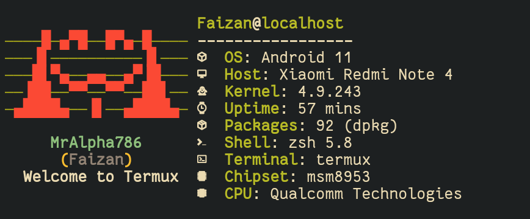

# androfetch
 A pretty system information tool written in bash for termux on android.


**Note**: Use meslo nerd font.


### created by [Laraib07](https://github.com/laraib07)

## Table of contents
* [Installation](#installation)
* [Usage](#usage)
* [Screenshots](#more-screenshots)

## Installation

**Note**: Delete previous cache manually with 
```bash
rm -rf ~/.cache/androfetch/cache
```

1. Install fonts ( optional , else disable icons with `androfetch -i` )
```bash
wget https://raw.githubusercontent.com/laraib07/androfetch/main/font.ttf && mv font.ttf ~/.termux/
```

or

```bash
curl -O https://raw.githubusercontent.com/laraib07/androfetch/main/font.ttf && mv font.ttf ~/.termux/
```

2. Installing androfetch.
```bash
wget https://raw.githubusercontent.com/laraib07/androfetch/main/androfetch && chmod u+x androfetch && mv androfetch $PREFIX/bin/
```

or

```bash
curl -O https://raw.githubusercontent.com/laraib07/androfetch/main/androfetch && chmod u+x androfetch && mv androfetch $PREFIX/bin/
``` 

## Usage

Usage : **androfetch**  [-hci] [-n name|reset] [ -l filepath|reset]

option |   Description
:-----:|:---------------------------:
  -h   |     print this usage
  -c   |     build new cache
  -i   |     toggle icon visibility
  -n   |     set user name
  -l   |     set logo

## More Screenshots




